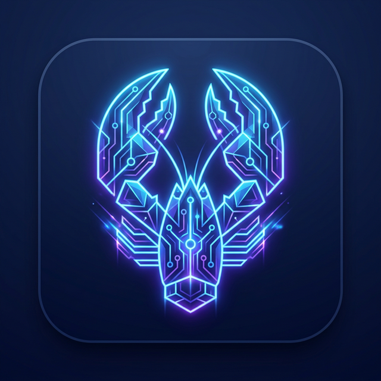

<picture>
  
</picture>

<br/>

# MacClaw Desktop

Welcome to the **MacClaw Desktop** application. This is a powerful, local AI GUI Agent.

## Setup Instructions

MacClaw uses `pnpm` as its package manager and Electron for the desktop wrapper. Follow these steps to get your development environment up and running:

### 1. Prerequisites
- **Node.js**: Ensure you have Node.js installed (v20+ recommended).
- **pnpm**: Install pnpm if you don't have it already:
  ```bash
  npm install -g pnpm
  ```

### 2. Install Dependencies
Navigate to the root directory of the project and install all required packages:
```bash
pnpm install
```

### 3. Start Development Server
To start the application in development mode with hot-reloading:
```bash
pnpm dev
```
*(Alternatively, you can use `pnpm debug` to open with the remote debugging port enabled).*

### 4. Build for Production
To package the application into a standalone executable for your platform:
```bash
pnpm package
```
If you are on an Apple Silicon Mac, you can also build and publish via:
```bash
pnpm publish:mac-arm64
```

### Configuration
- Ensure your AI provider keys (like OpenRouter) are set up in the Settings UI inside the app once it launches.
- Avoid committing `.env` files with actual secrets in them.

---
*Built with [Electron-Vite](https://electron-vite.org/) and React.*
# MacClaw & OpenRouter Setup Guide

Welcome to **MacClaw**! This sleek, AI-powered desktop automation agent has been explicitly optimized to work out-of-the-box with OpenRouter, providing seamless access to the Vision-Language Model (VLM) responsible for reasoning about your screen and controlling your computer.

Follow these simple steps to configure MacClaw and start automating.

## Prerequisites
- You must have MacClaw built and installed (or running in development mode via `npm run dev:macclaw`).
- You need an active [OpenRouter](https://openrouter.ai/) account.

## Step 1: Obtain Your OpenRouter API Key
1. Navigate to the [OpenRouter Keys Page](https://openrouter.ai/keys).
2. Log in (or sign up if you haven't already).
3. Click on **"Create Key"**.
4. Give your key a recognizable name (e.g., *MacClaw Agent*).
5. Copy the generated API key and store it securely. You will need it in the next step.

> Note: To ensure smooth operation, make sure you have sufficient credits on your OpenRouter account, as VLMs can consume a notable amount of tokens when processing high-resolution screenshots of your desktop.

## Step 2: Configure MacClaw
1. Open the **MacClaw** application. 
2. Upon its first launch, you will see the modern, glassmorphic central interface.
3. In the top-right corner of the window (or inside the system tray menu), locate and click on the **Settings Gear Icon** (⚙️).
4. The settings drawer will slide open. Navigate to the **VLM Settings** step.
5. In the input field labeled **"OpenRouter API Key"**, paste the API key you copied in Step 1.
   
*(Note: Because MacClaw is heavily optimized, the OpenRouter API Base URL and the core reasoning model `bytedance/ui-tars-1.5-7b` are already pre-configured—you only need to provide the key!)*

## Step 3: Start Automating!
1. Once your key is pasted, simply click on the **"Get Start"** or **"Start"** button at the bottom of the Settings window to save your configuration.
2. Return to the main chat interface on the Home Screen.
3. Select your mode (Computer Operator vs Browser Operator) via the central toggle.
4. Type your instruction, like: *"Open Chrome, navigate to Hacker News, and read the top headline"*
5. Hit **Enter** and watch MacClaw drive your computer!

## Troubleshooting
- **Failed to execute instructions or receiving 401 Unauthorized:** Double check that your OpenRouter API key was pasted correctly without any hidden trailing spaces. Verify that your OpenRouter account has positive credit.
- **MacClaw isn't clicking the right spots:** Make sure MacClaw has the proper macOS Accessibility and Screen Recording permissions granted in your System Settings -> Privacy & Security.
